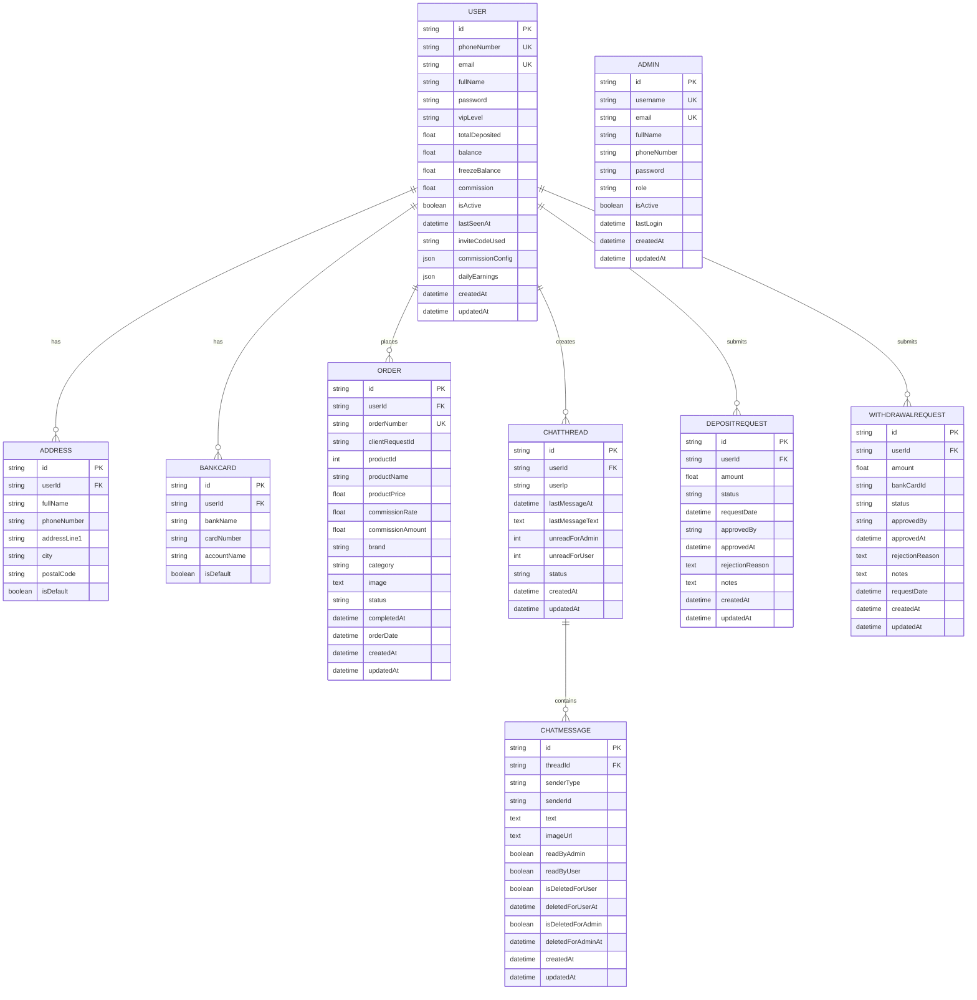
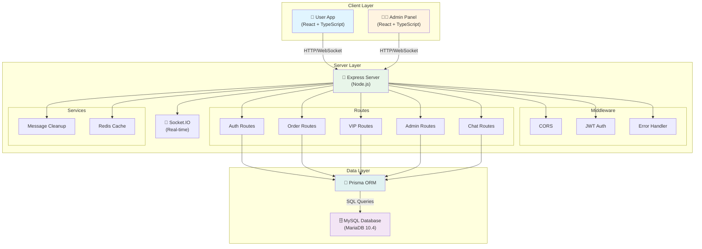
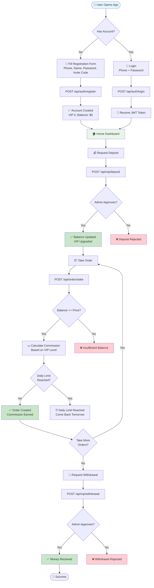
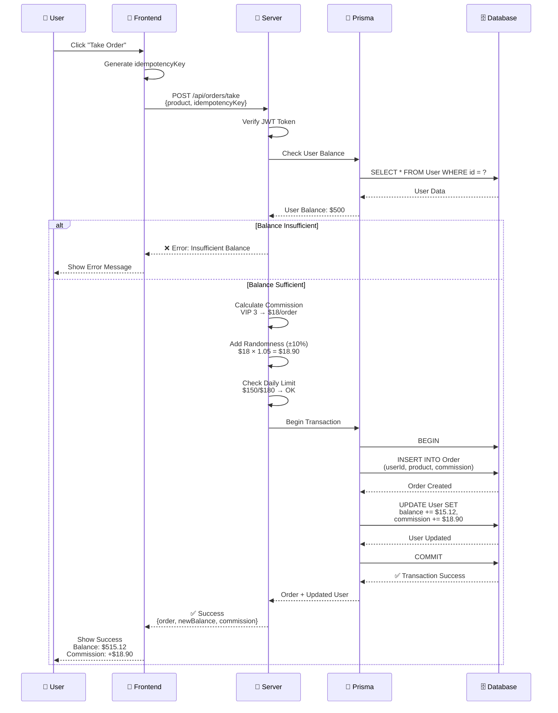
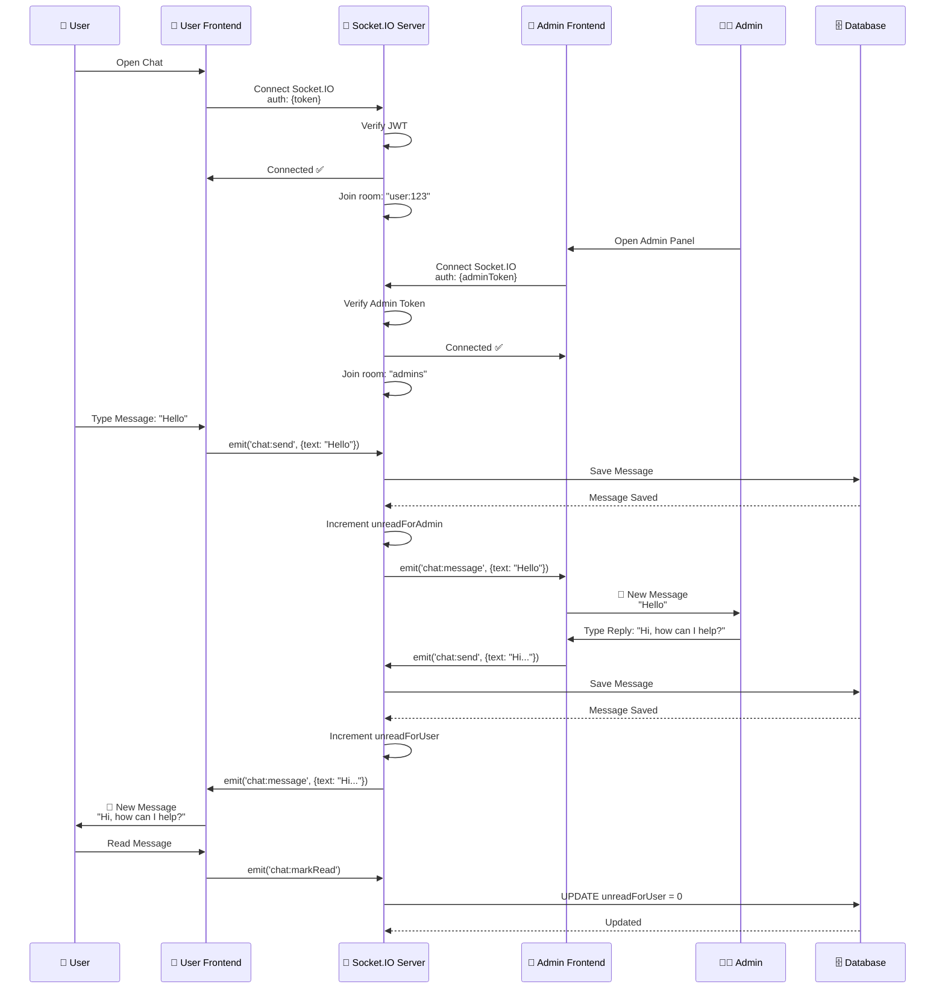
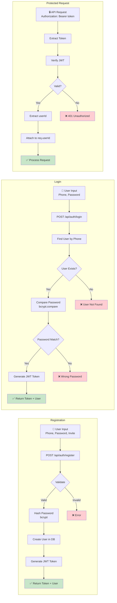
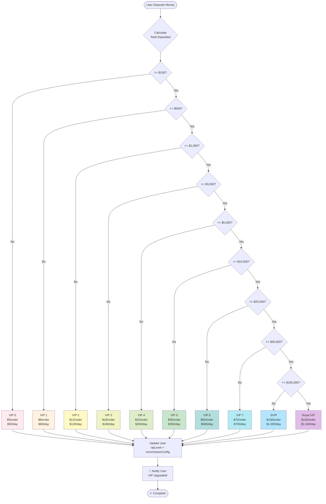
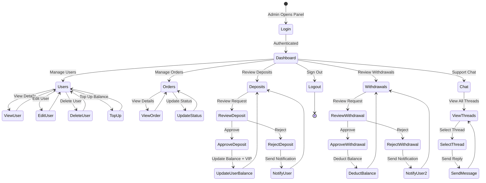

# 🎨 Mermaid Diagrams - Greeting Message Platform

## 1. 📊 Database ERD (Entity Relationship Diagram)

---

## 2. 🏗️ System Architecture

---

## 3. 🔄 User Journey Flow

---

## 4. 💰 Order & Commission Flow

---

## 5. 💬 Real-time Chat Flow

---

## 6. 🔐 Authentication Flow

---

## 7. 📊 VIP System Flow

---

## 8. 🔄 Admin Workflow

---

## 📝 Notes

Các mermaid diagram này có thể render trực tiếp trên:
- ✅ GitHub
- ✅ GitLab
- ✅ VS Code (với extension)
- ✅ Notion
- ✅ Confluence
- ✅ Mermaid Live Editor (https://mermaid.live)

**Cách sử dụng:**
1. Copy code mermaid
2. Paste vào markdown file
3. View trên platform hỗ trợ mermaid

**Hoặc export sang:**
- PNG/SVG: Dùng Mermaid CLI hoặc Live Editor
- PDF: Dùng Pandoc hoặc Markdown to PDF tools
